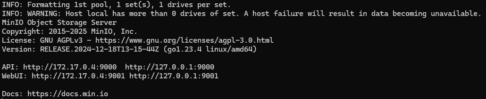
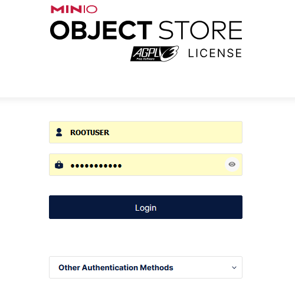

Инсталяция MinIO для Windows 
############################

В следующем примере описана инсталяция для Windows
**************************************************

Инструкции доступны как для GNU/Linux и MacOS, так и для Windows

.. code-block:: bash
    
    docker run -p 9000:9000 -p 9001:9001 --name minio1 -v ~/minio/data:/data -e "MINIO_ROOT_USER=ROOTUSER" -e "MINIO_ROOT_PASSWORD=CHANGEME123" quay.io/minio/minio server /data --console-address ":9001"

Пример выше работает следующим образом:

* **docker run** запуск MinIO контейнера.
* **-p** привязка локального порта к порту контейнера.
* **-name** создание имени для контейнера.
* **-v** устанавливает путь к файлу в качестве постоянного местоположения для использования контейнером. 
  Когда MinIO записывает данные в ``/data``, эти данные отражаются в локальном пути ``~/minio/data``, что позволяет им сохраняться между перезапусками контейнера. 
  Вы можете заменить ``~/minio/data`` другим локальным расположением файла, к которому у пользователя есть доступ 
  на чтение, запись и удаление.
* **-e** устанавливает переменные среды ``MINIO_ROOT_USER`` и ``MINIO_ROOT_PASSWORD`` соответственно. 
  Они устанавливают учетные данные пользователя root. Измените значения примера, которые будут использоваться для вашего контейнера.

В терминале вы должны увидеть приблизительно следующее:

- Для доступа к WebUI перейдите по ссылке в браузере http://127.0.0.1:9001 
- На странице входа, введите логин и пароль указаный выше.

Вы можете использовать консоль MinIO для задач общего администрирования, таких как управление идентификацией и доступом, 
мониторинг метрик и журналов или настройка сервера. Каждый сервер MinIO включает в себя собственную встроенную консоль MinIO.

Дополнительные источники
************************

`Официальная документация`_

.. _Официальная документация: https://min.io/docs/minio/container/index.html
