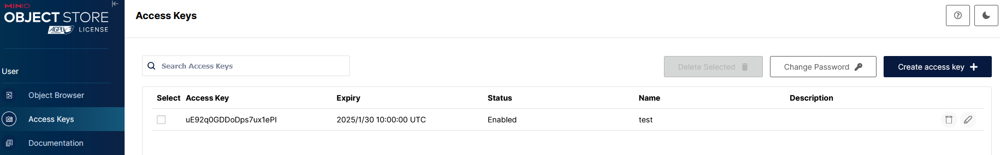
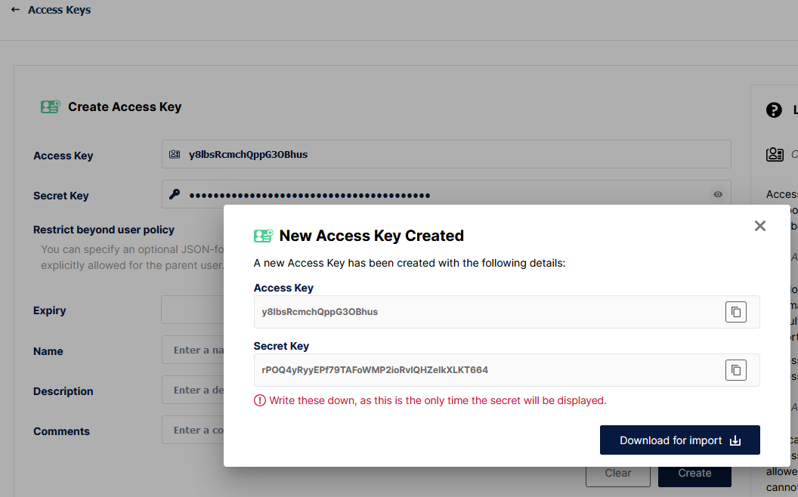

Использование MinIO и Python 
############################

Создание ключей доступа в WebUI консоли
***************************************   

Для возможности работы с API MinIO создайте ключи в разделе "Access Keys" консоли MinIO  http://127.0.0.1:9001

Сохраните и скачайте файл ``credentials.json`` для возможности доступа через API

- Создайте виртуальную среду, для этого создайте пакетный файл Windows. В текстовом редакторе добавьте следующую строку и сохраните файл с раcширением .cmd

.. code-block:: bash
    
    %LocalAppData%\Programs\Python\Python311\python -m venv %cd%\venv
    pause

- Создайте виртуальную среду и запустите файл двойным нажатием для создания виртуальной среды 

- Создйте файл для активации среды. В текстовом редакторе добавьте следующую строку и сохраните второй файл с раcширением .cmd

.. code-block:: bash
    
    call cmd /K  %cd%\venv\scripts\activate

- Установите зависимости из файла:
  
  #. Активируйте виртуальную среду (второй файл с раcширением .cmd)
  #. Создайте файл ``requirements.txt`` в текстовом редакторе и добавьте необходимые пакеты и зависимости

.. code-block:: bash

    jupyterlab
    minio

- Используйте ``requirements.txt`` для инсталяции пакетов через ``pip`` 

.. code-block:: bash
    
    pip install -r requirements.txt

Jupyter Lab
***********

Запустите JupyterLab интерактивную среду разработки в консоли с активированным окружением

.. code-block:: bash
    
    jupyter lab

Для проверки подключения в ячейку блокнота добавьте следующий код:

.. code-block:: python
    
    import json
    from minio import Minio

    with open('credentials.json', encoding='utf-8') as fh:
        cred = json.load(fh)

    client = Minio("localhost:9000", access_key=cred['accessKey'], secret_key=cred['secretKey'], secure=False)

Используйте из файла ``credentials.json`` ключи для подключения ``access_key``, ``secret_key``

