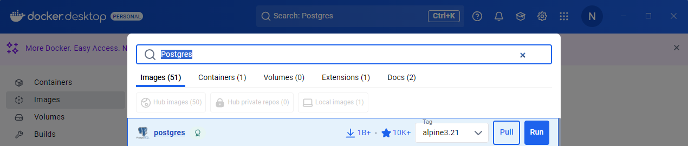
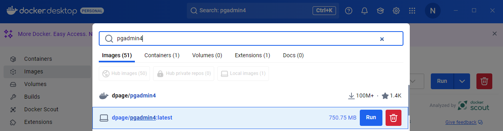
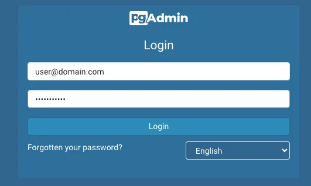
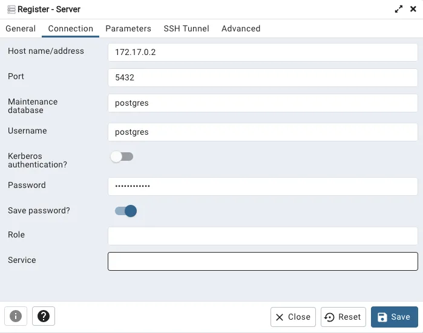
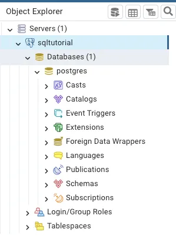

PostgreSQL
##########

Инсталяция Docker
*****************

Установка Docker зависит от операционной системы. 
Следуйте инструкциям в зависимости от операционной системы для наших целей достаточно `бесплатной версии`_

.. _бесплатной версии: https://docs.docker.com/engine/install/?source=post_page-----4a8d81048aea--------------------------------

Установка и настройка PostgreSQL
********************************

Чтобы установить PostgreSQL для Docker, необходимо открыть терминал, командную строку или PowerShell, 
в зависимости от операционной системы. Docker — это легкий, автономный и исполняемый пакет программного обеспечения, 
который включает в себя все необходимое для запуска программного обеспечения, включая код, среду выполнения,
библиотеки, переменные среды и системные инструменты.

Используйте следующую команду, чтобы **получить образ Postgres:**

.. code-block:: bash
    
    docker pull postgres

Или найдите образ в строке поиска **docker.desktop**

После получения образа Docker следующим шагом будет запуск контейнера Docker, 
чтобы инициировать базу данных и сделать ее работоспособной.

Контейнер Docker — это легкая и изолированная среда выполнения, которая инкапсулирует необходимые зависимости, 
конфигурации и код приложения, что позволяет ему согласованно работать в разных системах.

Используйте следующую команду для создания Docker-контейнера (не забудьте сменить пароль):

.. code-block:: bash
    
    docker run --name sqltutorial -e POSTGRES_PASSWORD=marviniscool -p 5432:5432 -d postgres

В Docker Desktop App вы увидите следующее:

Мы создали контейнер с помощью команды docker run, мы используем имя, чтобы выбрать имя для нашего контейнера, 
параметр **-e** позволяет нам устанавливать переменные среды, в этом случае мы устанавливаем пароль базы данных на *«marviniscool»* (не забудьте изменить пароль),
мы используем **-d**, чтобы позволить контейнеру работать в автономном режиме, и указываем, что мы хотим использовать образ Postgres. 
В этой команде мы упростили задачу, установив порт 5432 на ПК с портом 5432 внутри контейнера, что удобно для последующего доступа 
к базе данных без какой-либо путаницы, связанной с портом. 
Дополнительно вы можете добавить **«POSTGRES_USER=mycustomuser»**, чтобы изменить имя пользователя с **«postgres»** на имя по вашему выбору. 
Если вы хотите узнать больше о Docker или команде запуска Docker, ознакомьтесь с `документацией`_  

.. _документацией: https://docs.docker.com/reference/cli/docker/container/run/

Альтернативно мы можем использовать командную строку, чтобы проверить, запущен ли докер-контейнер, 
выполнив следующую команду:

.. code-block:: bash

    docker ps

Инсталяция PgAdmin4
*******************

Процесс установки аналогичен процессу установки PostgreSQL. 
Мы собираемся получить образ pgAdmin 4 с помощью Docker, что упрощает процесс установки.

Введите следующую команду в свой терминал, чтобы установить **pgAdmin 4:**

.. code-block:: bash

    docker pull dpage/pgadmin4

Или найдите образ в строке поиска docker.desktop

Вы должны увидеть изображение на вкладке «Images» вашего настольного приложения Docker.
Загрузив образ, мы можем создать и запустить наш Docker-контейнер. 
Приведенная ниже команда устанавливает новый контейнер Docker с именем **«pgadmin-container»**, сопоставляет порт **5050**
на вашем компьютере с портом **80** в контейнере и устанавливает адрес электронной почты и пароль по умолчанию для доступа к интерфейсу pgAdmin 4.

Вот команда для запуска докер-контейнера **pgAdmin 4:**

.. code-block:: bash
    
    docker run --name pgadmin-container -p 5050:80 -e PGADMIN_DEFAULT_EMAIL=user@domain.com -e PGADMIN_DEFAULT_PASSWORD=catsarecool -d dpage/pgadmin4

Не забудьте заменить «user@domain.com» и «catsarecool» своим адресом электронной почты и паролем.

Подключение к контейнеру базы данных с помощью pgAdmin 4
********************************************************

После успешного запуска контейнера (если у вас возникнут какие-либо проблемы, 
рекомендуется проверить приложение Docker Desktop, чтобы убедиться, что контейнер работает), 
вы можете получить доступ к **pgAdmin**, перейдя по адресу **localhost:5050** в выбранном вами веб-браузере.

Прежде чем продолжить, важно получить IP-адрес контейнера «sqltutorial». 
Чтобы найти IP-адрес, вы можете выполнить следующую команду в своем терминале (Linux/macOS) или PowerShell (Windows):

.. code-block:: bash

    docker inspect -f '{{range .NetworkSettings.Networks}}{{.IPAddress}}{{end}}' sqltutorial

В нашем случае он вернул IP-адрес 172.17.0.2 , теперь вводим всю информацию о подключении:

* **Имя/адрес хоста:** 172.17.0.2 (у вас может быть иначе)
* **Порт**: 5432
* **База данных:** postgres
* **Имя пользователя:** postgres (или другое имя, если вы его изменили)
* **Пароль:** marviniscool (или любой другой выбранный вами пароль)
* **Необязательно:** установите для пароля сохранения значение true.

Нажмите «Сохранить», и вы сможете выбрать сервер базы данных из меню слева:

Поздравляем, теперь ваша среда должна быть запущена и работать. По вопросам pgAdmin 4 обратитесь к `документации`_

.. _документации: https://www.pgadmin.org/docs/pgadmin4/development/index.html?source=post_page-----4a8d81048aea--------------------------------

Cоздания базы Postgre из файла sql на Windows с Docker
******************************************************

Скачайте одну из демонстрационных баз `данных`_. 
Возможно для скачивания потребуется подключение через **VPN**.

.. _данных: https://postgrespro.ru/docs/postgrespro/15/demodb-bookings-installation

Скопируйте файл дампа в контейнер:
==================================

* Убедитесь, что ваш файл дампа (например, database.sql) находится в текущей директории или укажите полный путь к нему.
* Скопируйте файл дампа в контейнер:

.. code-block:: bash

    docker cp database.sql my_postgres_container:/database.sql

Восстановите базу данных из дампа:
==================================

* Подключитесь к контейнеру:

.. code-block:: bash

   docker exec -it my_postgres_container bash

* Внутри контейнера выполните команду для восстановления базы данных:

.. code-block:: bash

    psql -U postgres -f /database.sql

Здесь:

* -U postgres — пользователь PostgreSQL.
* -f /database.sql — путь к файлу дампа внутри контейнера.

Подключение Dbeaver к базе Postgre в Docker 
*******************************************

Дополнительные источники
************************

* `Medium`_ 

.. _Medium: https://medium.com/@marvinjungre/get-postgresql-and-pgadmin-4-up-and-running-with-docker-4a8d81048aea

* `Le Chat Mistral`_

.. _Le Chat Mistral: https://chat.mistral.ai/chat