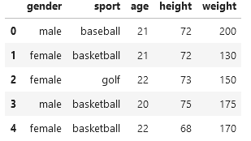
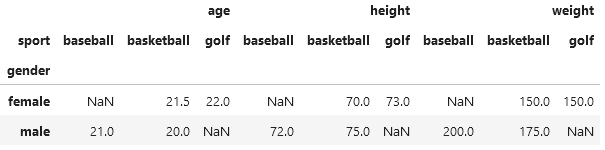
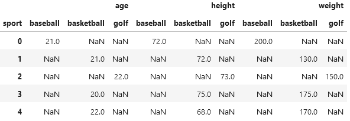
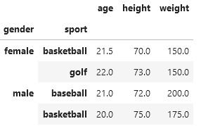
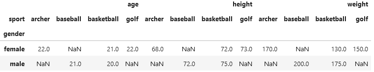

Pandas
######

pivot_table, pivot и groupby
****************************

У нас есть небольшой датасет из 5 студентов

.. code-block:: python

    students = pd.DataFrame(
        {"gender": ["male", "female", "female", "male", "female"],
        "sport": ["baseball", "basketball", "golf", "basketball", "basketball"],
        "age": [21, 21, 22, 20, 22],
        "height": [72, 72, 73, 75, 68],
        "weight": [200, 130, 150, 175, 170]
        }
    )



.. code-block:: bash

    <class 'pandas.core.frame.DataFrame'>
    RangeIndex: 5 entries, 0 to 4
    Data columns (total 5 columns):
    #   Column  Non-Null Count  Dtype 
    ---  ------  --------------  ----- 
    0   gender  5 non-null      object
    1   sport   5 non-null      object
    2   age     5 non-null      int64 
    3   height  5 non-null      int64 
    4   weight  5 non-null      int64 
    dtypes: int64(3), object(2)
    memory usage: 332.0+ bytes


Pivot Table
-----------

Давайте передадим столбец «gender» в параметр индекса (результирующий левый столбец),
передайте параметр столбца, равный «спорт», и нашим параметром значений (данные в полученных ячейках) будут «возраст», «рост» и «вес».

Я явно ввел aggfunc в значение «mean», которое является значением по умолчанию, если оно не установлено явно.
Мы сохраним результат в Student_pivot_tab для удобства использования.
Вызов функции Pivot_table для нашего исходного фрейма данных, результаты таблицы:


.. code-block:: python

    student_pivot_tab = students.pivot_table( index='gender', columns='sport', values=['age','height','weight'], aggfunc='mean')
    student_pivot_tab



Как мы и указывали, ``gender`` значения теперь находятся в крайнем левом столбце.
Значения из предыдущего столбца ``sport`` теперь являются заголовками столбцов.
Значения в ячейках представляют собой средние значения столбцов возраста, роста и веса.

.. Note::

    ’NaN вставляются там, где значений нет. Например, в этом наборе данных нет женщин-бейсболисток.

Довольно круто! Теперь мы видим только 2 строки данных, которые агрегируются для данных.

Pivot
-----

Хорошо, давайте сделаем то же самое с функцией Pivot.

.. code-block:: python

    student_pivot = students.pivot(index='gender', columns='sport', values=['age','height','weight'])

Это приводит к ошибке:

.. code-block:: python

    ValueError: Index contains duplicate entries, cannot reshape

Что это значит?
**Давайте попробуем ту же команду без аргумента индекса.**

Без явно заданного индекса мы получим следующие результаты:




В результате появляются столбцы ``sport``, но не столбцы ``gender``. Обратите внимание, что фрейм данных имеет индекс нашего исходного фрейма данных (0…4), 
который находится там по умолчанию. Также есть ``NaN``, введенные для значений, которых не существует, поскольку мы транспонировали строки в столбцы.

Вернемся к ошибке:

.. code-block:: python

    ValueError: Index contains duplicate entries, cannot reshape

Когда в сводной таблице индекс установлен на ``gender``, функция пытается установить левый ключ ``female``, 
а затем сопоставить имя столбца с различными значениями вида спорта (basketball). 
В данном случае есть две строки ``female`` и колонки ``basketball``. **Функция не знает, какое значение поместить в значения ячеек.**


Чтобы решить эту проблему, в функции Pivot_table мы передали aggfunc = ``mean``.

Это похоже на то, когда вы говорите теле-компании воспроизвести фильм, теле-компания спрашивает, хотите ли вы воспроизвести это на Prime TV, Netflix или Apple TV.

.. Note::

    Возвращаясь к функции ``Pivot_table``, мы уже сказали ей усреднять значение.
    Функция ``Pivot``` не понимает повторяющихся ключей, поэтому выдает ошибку повторяющихся записей!

GroupBy
-------

Давайте посмотрим на те же данные с помощью функции ``groupby``. Она также возвращает data frame на основе вашего ввода. Просто он в другой форме.

.. code-block:: python

    student_groupby = students.groupby(['gender','sport']).agg('mean')
    student_groupby



.. Note:: 
    
    Разная форма представления данных. Давайте посмотрим ``info()`` об этом.

.. code-block:: python

    student_groupby.info()

.. code-block:: bash

    <class 'pandas.core.frame.DataFrame'>
    MultiIndex: 4 entries, ('female', 'basketball') to ('male', 'basketball')
    Data columns (total 3 columns):
    #   Column  Non-Null Count  Dtype  
    ---  ------  --------------  -----  
    0   age     4 non-null      float64
    1   height  4 non-null      float64
    2   weight  4 non-null      float64
    dtypes: float64(3)
    memory usage: 253.0+ bytes

Мультииндекс из 4 записей, основанный на переданном нами индексе и столбцах, представляет собой комбинацию двух значений пола и двух значений спорта.

**Что насчет информации о pivot dataset?**

Без ``gender`` индекса (помните: с ним мы получаем **ValueError** из-за дублирования ключей) получаем:

.. code-block:: python

    student_pivot.info()

.. code-block:: bash

    <class 'pandas.core.frame.DataFrame'>
    Index: 5 entries, 0 to 4
    Data columns (total 9 columns):
    #   Column                Non-Null Count  Dtype  
    ---  ------                --------------  -----  
    0   (age, baseball)       1 non-null      float64
    1   (age, basketball)     3 non-null      float64
    2   (age, golf)           1 non-null      float64
    3   (height, baseball)    1 non-null      float64
    4   (height, basketball)  3 non-null      float64
    5   (height, golf)        1 non-null      float64
    6   (weight, baseball)    1 non-null      float64
    7   (weight, basketball)  3 non-null      float64
    8   (weight, golf)        1 non-null      float64
    dtypes: float64(9)
    memory usage: 400.0 bytes


**Что насчет информации о student_pivot_tab?**

.. code-block:: python

    student_pivot_tab.info()

.. code-block:: bash

    <class 'pandas.core.frame.DataFrame'>
    Index: 2 entries, female to male
    Data columns (total 9 columns):
    #   Column                Non-Null Count  Dtype  
    ---  ------                --------------  -----  
    0   (age, baseball)       1 non-null      float64
    1   (age, basketball)     2 non-null      float64
    2   (age, golf)           1 non-null      float64
    3   (height, baseball)    1 non-null      float64
    4   (height, basketball)  2 non-null      float64
    5   (height, golf)        1 non-null      float64
    6   (weight, baseball)    1 non-null      float64
    7   (weight, basketball)  2 non-null      float64
    8   (weight, golf)        1 non-null      float64
    dtypes: float64(9)
    memory usage: 160.0+ bytes

Индекс основан на двух значениях пола, которые мы передали при создании сводной таблицы.

Кроме того, например, давайте изменим вторую баскетболистку на лучницу.

.. code-block:: python

    students.loc[4, 'sport'] = 'archer'
    students

Результаты данных вызова ``Pivot_table`` и ``Pivot`` абсолютно одинаковы! Ошибка ValueError: исчезла.

.. code-block:: python

    student_pivot = students.pivot(index='gender', columns='sport', values=['age','height','weight'])
    student_pivot



.. code-block:: python

    student_pivot_tab = students.pivot_table( index='gender', columns='sport', values=['age','height','weight'], aggfunc='mean')
    student_pivot_tab


.. code-block:: python

    if student_pivot.equals(student_pivot_tab):
        print("Я равен!")

    "Я равен!"

Краткое содержание
------------------

* Все дело в индексах и форме возвращаемого фрейма данных.
* Является ли возвращаемый data frame ``MultiIndexed`` или нет? Это следует учитывать при визуализации с помощью ``Matplotlib`` или ``Seaborn`` и изучении данных. 
  Сравните основные гистограммы для каждого из них.
* ``Pivot`` и ``Pivot_table`` могут иметь одинаковую функциональность только в том случае, если позволяют данные. 
  Если из интересующего индекса(ов) возможны повторяющиеся записи, вам нужно будет агрегировать данные в ``pivot_table``, а не ``pivot`` (из-за ошибки дублирования).
* ``Groupby`` позволяет группировать по аналогичным образом, а также объединять агрегатные функции.


Источник
--------

https://danielmsmith1.medium.com/pivot-vs-pivottable-vs-groupby-2d8723beb782
